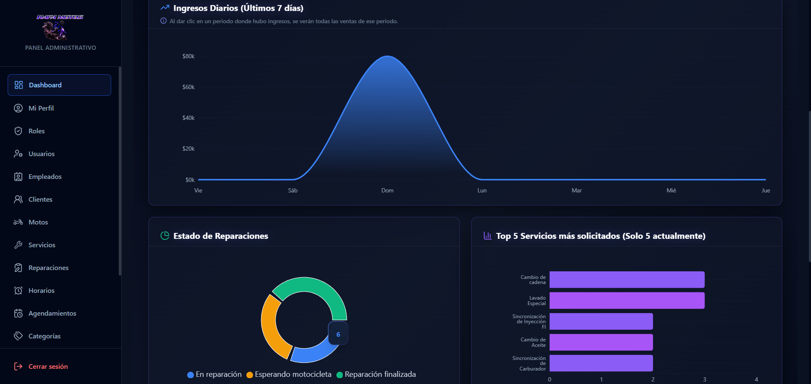
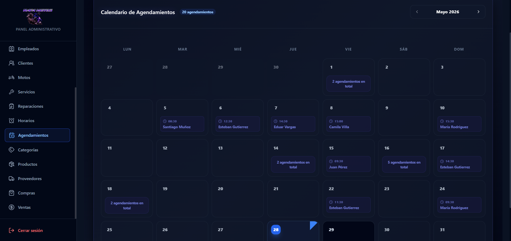
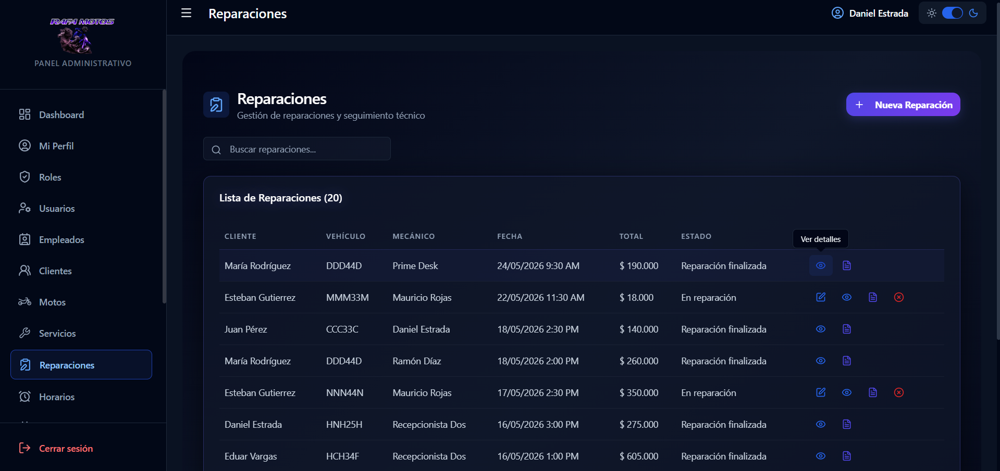
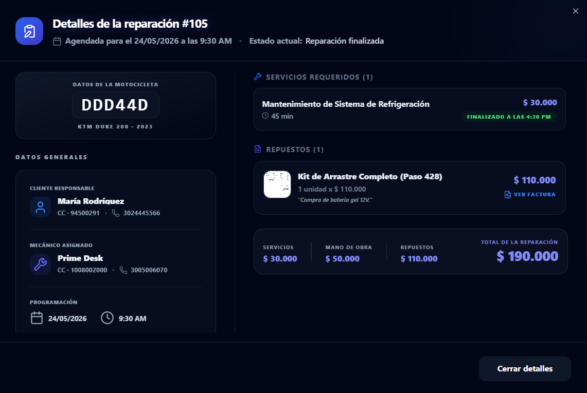

#  PrimeDesk
### **Sistema Integral de Gestión y Automatización para Talleres de Motocicletas**


---

##  Demos en Vivo

*   **Aplicación Frontend:** [https://primedesk-frontend.vercel.app/](https://primedesk-frontend.vercel.app/)
*   **Servidor API Backend:** [https://primedeskbackend.onrender.com](https://primedeskbackend.onrender.com)

---

##  Descripción del Proyecto

**PrimeDesk** es una solución de software diseñada a medida para optimizar, digitalizar y automatizar los procesos operativos y administrativos del taller *Rafa Motos*. El sistema fue desarrollado con una arquitectura modular enfocada en la mantenibilidad, escalabilidad y rendimiento óptimo en entornos concurrentes.

La plataforma cubre todo el ciclo de vida del negocio, incluyendo el registro y control de vehículos, la reserva inteligente de turnos mecánicos, la facturación directa de servicios y compras bajo demanda, y reportes analíticos en tiempo real.



---

##  Stack Principal

*   **Frontend:** React 19 + TypeScript + Vite + TailwindCSS + Radix UI
*   **Backend:** Node.js + Express.js
*   **Base de Datos:** PostgreSQL + Supabase
*   **Autenticación:** JWT (JSON Web Tokens)
*   **Envío de Correos:** Resend API

---

##  Resumen de Módulos

| Módulo | Funcionalidades Principales |
| :--- | :--- |
| **Dashboard** | Visualización de ingresos, KPIs mensuales, estadísticas de servicios y feed de actividades recientes. |
| **Reparaciones** | Control de estados del taller, asignación de mecánicos, desglose de tareas e historial por placa. |
| **Agendamientos** | Reserva inteligente de turnos con validación de disponibilidad y gestión de horarios del personal. |
| **Ventas y Compras** | Facturación de servicios, compras específicas Just-in-Time y exportación de facturas a PDF. |
| **CRM (Contactos)** | Ficheros maestros de clientes, vinculación de vehículos y directorio fiscal de proveedores. |
| **RBAC (Seguridad)** | Autenticación y control de acceso basado en roles con rutas y endpoints protegidos. |

---

##  Detalles de los Módulos del Sistema

### 1. Dashboard de Analítica Comercial
*   **KPIs en Tiempo Real:** Cálculo de ingresos mensuales netos con indicadores de variación porcentual.
*   **Gráficos Interactivos:** Visualización de tendencias con gráficos de área para ingresos, gráficos de torta para el estado de reparaciones y listados de servicios solicitados.
*   **Feed de Actividad:** Consolidación de eventos clave (ventas realizadas, agendamientos registrados y reparaciones finalizadas) en un panel único.

### 2. Gestión Inteligente de Agendamientos y Horarios
*   **Reserva de Citas:** Permite a los clientes reservar turnos seleccionando fecha, hora y el mecánico de su preferencia.
*   **Validación de Disponibilidad:** Evita la superposición horaria o sobre-agendamientos de un mismo mecánico.
*   **Novedades de Horario:** Panel de administración de jornadas laborales, días no laborales y excepciones de horario para cada empleado.



### 3. Control del Taller y Reparaciones
*   **Trazabilidad del Servicio:** Seguimiento interactivo del estado de reparación en tiempo real (Esperando motocicleta, En Reparación, Reparación Finalizada, Anulada).
*   **Asignación Dinámica:** Hoja de servicios con desglose de tareas técnicas aplicadas, repuestos utilizados y mano de obra cobrada.
*   **Historial de reparaciones del Vehículo:** Tabla de reparaciones organizadas por fecha, de mas actual a menos actual, manteniendo las ya finalizadas o anuladas.



### 4. Compras, Ventas y Repuestos Bajo Demanda
*   **Facturación de Servicios y Repuestos:** Registro de ventas asociadas a las reparaciones y mantenimientos realizados en el taller desde el modulo de Reparaciones.
*   **Compras por demanda (Sin Stock ni Inventario):** Siguiendo el modelo operativo del taller *Rafa Motos*, el sistema no gestiona inventario físico ni stock de productos. Las compras a proveedores se realizan y asocian exclusivamente a reparaciones específicas; todo repuesto adquirido se consume de manera inmediata en la motocicleta correspondiente.
*   **Generador Automático de Facturas:** Exportación automática de facturas y órdenes de servicio en PDF de diseño limpio, listas para enviar al cliente o imprimir.



### 5. Gestión de Clientes, Motocicletas y Proveedores
*   **Fichero Maestro:** Registro y vinculación directa de clientes y sus motocicletas (Marca, Modelo, Placa, Kilometraje, Año, Cilindrada).
*   **Directorio de Proveedores:** Base de datos de proveedores asociados con información fiscal y el historial de compras directas vinculadas.

### 6. Control de Usuarios, Roles y Permisos (RBAC)
*   **Acceso Basado en Roles:** Jerarquía de perfiles de acceso (Administrador, Empleado, Mecánico, Cliente) con permisos granulares.
*   **Middlewares de Ruta:** Protección de endpoints mediante tokens de sesión y validación de rol autorizador en el backend.

---

##  Estructura del Repositorio

```text
PrimeDesk/
│
├── frontend/             # Cliente React SPA
│   ├── src/
│   │   ├── assets/       # Imágenes, logos y recursos estáticos
│   │   ├── components/   # Componentes estructurados por módulos de negocio (Ventas, Reparaciones, etc.)
│   │   ├── config/       # Variables de cliente, constantes y utilidades de configuración
│   │   ├── contexts/     # Contextos de sesión y temas globales
│   │   ├── layouts/      # Plantillas de diseño responsivas (DashboardLayout, ClientLayout)
│   │   ├── lib/          # Clases y utilidades reutilizables (Tailwind merge)
│   │   ├── providers/    # Proveedores de estado de alto nivel
│   │   └── routes/       # Enrutamiento modular con seguridad de roles y guards
│   ├── tailwind.config.js
│   └── vite.config.ts
│
├── backend/              # API Restful en Node/Express
│   ├── src/
│   │   ├── config/       # Conexiones de base de datos (Postgres/Supabase), JWT y SDKs
│   │   ├── controllers/  # Controladores de solicitudes HTTP (lógica de presentación)
│   │   ├── middlewares/  # Controladores de acceso, validación de schemas y control de errores
│   │   ├── routes/       # Rutas unificadas agrupadas por módulos de negocio
│   │   └── services/     # Lógica de negocio pura y consultas SQL parametrizadas a la BD
│   ├── package.json
│   └── .env.example
│
├── package.json          # Orquestador raíz para ejecución concurrente
└── .gitignore            # Gitignore unificado global
```

---

##  Instalación y Configuración Local

### **Requisitos Previos**
*   Node.js (versión 18 o superior instalada).
*   Gestor de paquetes npm (incluido en Node).
*   Una instancia activa de PostgreSQL (o Supabase) con la estructura de tablas.

### **Paso 1: Clonar el Repositorio**
```bash
git clone https://github.com/Dandres619/PrimeDesk.git
cd PrimeDesk
```

### **Paso 2: Configurar Variables de Envío**
Crea un archivo `.env` tanto en la carpeta `frontend/` como en `backend/` tomando como referencia los archivos `.env.example` incluidos en cada una.

### **Paso 3: Instalar Dependencias del Proyecto**
Ejecuta la instalación desde el directorio raíz. El gestor descargará las dependencias de manera paralela:
```bash
npm install
```

### **Paso 4: Ejecutar en Entorno de Desarrollo**
Para iniciar el servidor backend (con nodemon para autoreload) y el servidor de desarrollo del frontend (Vite) de manera simultánea en una sola consola:
```bash
npm run dev
```

---

##  Scripts Disponibles

Ejecuta estos comandos en la raíz del proyecto para trabajar en local:

```bash
npm run dev       # Inicia frontend y backend de forma simultánea
npm run build     # Crea el build de producción para el frontend
npm run lint      # Ejecuta el validador de sintaxis ESLint
npm run preview   # Previsualiza localmente el build de producción del frontend
```

---

##  Decisiones Técnicas y Arquitectura

*   **Clean Code & Refactorización:** Reestructuración de la base de código inicial, abstrayendo componentes gigantescos en archivos modulares limpios (reemplazo de enrutamiento lineal por sistemas de enrutamiento desacoplados con layouts y contextos lógicos bien definidos).
*   **Optimización de Consultas SQL:** Escritura de consultas parametrizadas optimizadas para evitar inyecciones SQL, y uso de agregaciones paralelas (`Promise.all`) para el dashboard, reduciendo la latencia de la base de datos.
*   **Manejo de Zona Horaria (`America/Bogota`):** Tratamiento riguroso de fechas y horas tanto en base de datos PostgreSQL como en la interfaz gráfica para evitar inconsistencias de 1 día causadas por las conversiones automáticas de UTC a nivel de servidor o base de datos.
*   **Configuración de Entorno de Desarrollo Concurrente:** Creación de un script automatizado que ejecuta tanto el frontend como el backend al mismo tiempo para optimizar los tiempos de trabajo locales.
*   **Seguridad en Rutas y Control de Acceso (RBAC):** Implementación de guardias de rutas protegidas en el frontend y middlewares verificadores de tokens JWT en el backend, garantizando que los clientes y diferentes tipos de empleados solo interactúen con recursos autorizados.
*   **Generación Dinámica de Archivos en Cliente:** Integración de `jspdf` y `html2pdf.js` para renderizar y descargar reportes y facturas en PDF en tiempo real directamente desde la interfaz de usuario, optimizando el consumo de recursos en el backend.
*   **Integración con Servicios Cloud y APIs Externas:** Configuración del SDK de Supabase para el almacenamiento persistente de archivos (buckets de fotos/logos) y el API de Resend para notificaciones y envío automático de correos en flujos de restauración de contraseñas.
*   **Validación Estricta de Datos en la API:** Uso de `express-validator` como capa intermedia de saneamiento y comprobación estructural de peticiones HTTP críticas (como agendamientos, compras y ventas) antes de impactar el motor de base de datos.
*   **Manejo de Base de Datos compatible con Connection Poolers:** Configuración del driver `postgres` deshabilitando *prepared statements* (`prepare: false`) para garantizar compatibilidad nativa con la infraestructura transaccional de Supabase (PGBouncer) sin saturar los sockets de conexión en entornos de alta concurrencia.

---

##  Roadmap de Desarrollo

- [ ] Notificaciones automáticas por WhatsApp para avisos de entrega del vehículo.

---

##  Licencia

Este proyecto se distribuye bajo la Licencia MIT. Consulta el archivo `LICENSE` para más detalles.
